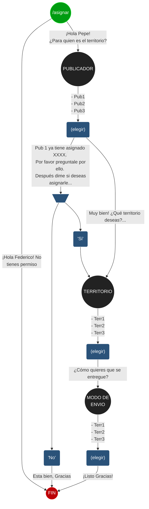

```mermaid
flowchart TB
    %% Documentation: https://mermaid-js.github.io/mermaid/#/flowchart
    A(("/asignar")):::entryPoint -->|¡Hola Pepe! \n ¿Para quien es el territorio?| B((PUBLICADOR)):::state
    A(("/asignar")):::entryPoint -->|¡Hola Federico! No \n tienes permiso| End((PUBLICADOR)):::state
    B --> |"- Pub1 <br /> - Pub2 <br /> - Pub3"|C("(elegir)"):::userInput 
    C --> |Pub 1 ya tiene asignado XXXX. \n Por favor preguntale por ello. \n Después dime si deseas asignarle... | D[\ /]:::userInput
    D --> O('No'):::userInput
    O --> |Esta bien, Gracias| End
    D --> P('Si'):::userInput
    P --> E((TERRITORIO))
    C --> |Muy bien! ¿Qué territorio deseas?...| E((TERRITORIO)):::state
    E --> |"- Terr1 <br /> - Terr2 <br /> - Terr3"|G("(elegir)"):::userInput
    G --> |"¿Cómo quieres que se entregue?"| I((MODO DE \n ENVIO)):::state
    I --> |"- Terr1 <br /> - Terr2 <br /> - Terr3"|R("(elegir)"):::userInput
    R --> |"¡Listo Gracias!"| End(("FIN")):::termination
    classDef userInput  fill:#2a5279, color:#ffffff, stroke:#ffffff
    classDef state fill:#222222, color:#ffffff, stroke:#ffffff
    classDef entryPoint fill:#009c11, stroke:#42FF57, color:#ffffff
    classDef termination fill:#bb0007, stroke:#E60109, color:#ffffff
```